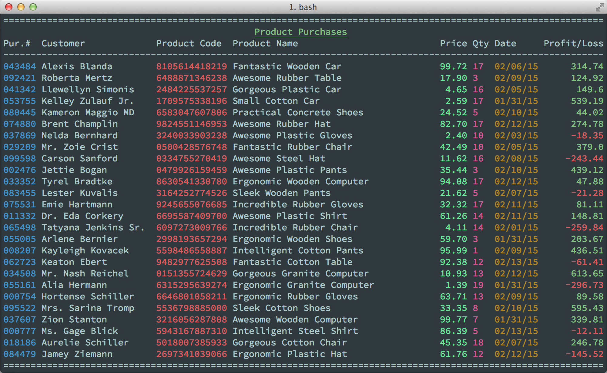

# ConsoleTable

ConsoleTable is a helper class that allows you to print data to a console in a clean, table-like fashion.  It's intended for use
in commandline applications with information-dense output.  It checks your terminal window size (or COLUMNS environment variable) to ensure
your data will fit, allows you to define table column sizes, and then just supply the ConsoleTable instance with data which will be
truncated or padded as needed to fit your specifications.

It can be used to generate output similar to this screenshot:



You're able to specify left/right/center text justification, headers, footers, and most importantly different sizes including exact character widths, screen percentages, and `*` for whatever is left.  If the window resizes the class will notice and output all new lines with recalculated locations (previous lines are not re-printed).

**Note**: This project is _not_ like `hirb` and it makes no attempt to take any sort of ActiveRecord objects or an array of data and automatically fit the data to a nice table.  It gives much, much more control over to the developer in how the output is formatted, but is much more difficult to work with as a trade-off - you will have to go through each element of your data set and manually munge it into the format needed by ConsoleTable to print a line.  ConsoleTable is meant to save on a lot of math and calculation, but will do no analyzing of your data itself in order to format it, please consult the Usage section for more details.


## Installation

Add this line to your application's Gemfile:

    gem 'console_table'

And then execute:

    $ bundle

Or install it yourself as:

    $ gem install console_table

## Usage

ConsoleTable needs a lot of information to get going, and it can be somewhat awkward to work with.

First, we need to define the layout of our table.  This consists of the exact order of the columns we want, their identifiers, titles, and sizes.  Because we want to specify order, the layout config is an array, and each element of the array is a hash of config values for the column that element of the array defines.  For example:

```ruby
table_config = [
   {:key=>:name, :size=>15, :title=>"Name"},
   {:key=>:birthday, :size=>8, :title=>"DOB"},
   {:key=>:nickname, :size=>0.3, :title=>"Nickname(s)"},
   {:key=>:motto, :size=>"*", :title=>"Motto"},
]

ConsoleTable.define(table_config) do |table|
	#Print data to the table here
end
```

Here we've defined a table with four columns, a Name, DOB, Nickname, and Motto.  As we defined the details of the columns, by using an array we also defined their order.  

* The Name column is exactly 15 characters wide, meaning that any data printed into that column will be right-padded with spaces to take up 15 characters, or if the name is longer than 15 characters it will be truncated. 
* Next is the DOB, this is another field that's exactly 8 characters.  
* After that is the Nickname, which has a size of 0.3, or 30%.  This column will take 30% of the available space in the window, but will never encroach on space allocated to exact-character sizes like DOB or Name.
* Last is Motto, whose size is simply `"*"`. The `"*"` is the default size as well, so the entire `:size` could have been left out of this column definition.  `"*"` means to consume whatever is left of the window.  You can have multiple `"*"` entries, and the available space will be divided among them equally.

Percentages and `*` sizes have no minimums, meaning they may not appear at all if the window is too small.  In this case, we have a table whose first column is 15 characters and whose second column is 8 characters.  The remaining columns will only appear if there is room, and there will be spaces between all four columns, so three spaces separating.  Thus, your window must be 15+8+3=26 characters wide or an exception will be thrown.

Once we have our table, we must print to it.  Printing a line of data means supplying the table with a `Hash` whose keys match the values for `:key` in the column config.  So for example, we might do:

```ruby
ConsoleTable.define(table_config) do |table|
	table << {
		:name=>"Rod",
		:birthday=>"04-14-80",
		:nickname=>"Chainsaw",
		:motto=>"It works on my machine"
	}
end
```

If we run this in a console exactly 80 characters wide, the result is:

```
===============================================================================
Name            DOB      Nickname(s)      Motto
-------------------------------------------------------------------------------
Rod             04-14-80 Chainsaw         It works on my machine
===============================================================================
```

We can specify justification options for columns as well, and even overwrite them when we supply row data, simply by using `Hash`es instead of `String`s for the values.  For example:

```ruby
table_config = [
   {:key=>:name, :size=>15, :title=>"Name"},
   {:key=>:birthday, :size=>8, :title=>"DOB"},
   {:key=>:nickname, :size=>0.3, :title=>"Nickname(s)", :justify=>:center},
   {:key=>:motto, :size=>"*", :title=>"Motto", :justify=>:right},
]

ConsoleTable.define(table_config) do |table|
	table << {
		:name=>"Rod",
		:birthday=>"04-14-80",
		:nickname=>{:text=>"Chainsaw", :justify=>:left},
		:motto=>"It works on my machine"
	}
end
```

This will output:

```
===============================================================================
Name            DOB        Nickname(s)                                    Motto
-------------------------------------------------------------------------------
Rod             04-14-80 Chainsaw                        It works on my machine
===============================================================================
```

Notice how the Nickname column specifies that the justification will be centered, but when we actually output the data we say `{:text=>"Chainsaw", :justify=>:left}` thus overriding the justification to be left.  As a result, the header name is centered, but the data is left-aligned.  In the case of motto, we set the justification to the right-aligned, but never override it, so both the column header and the data itself are right-aligned.

There are lots of different supported options for outputting the row data elements, here's a pretty comprehensive example and it's output

```ruby
table_config = [
   {:key=>:name, :size=>15, :title=>"Name"},
   {:key=>:birthday, :size=>8, :title=>"DOB"},
   {:key=>:nickname, :size=>0.3, :title=>"Nickname(s)", :justify=>:center},
   {:key=>:motto, :size=>"*", :title=>"Motto", :justify=>:right}
]

ConsoleTable.define(table_config) do |table|
	table << {
		:name=>"Rod".colorize(:red) #Uses 'colorize' gem
		:birthday=>"04-14-80".blue,
		:nickname=>{:text=>"Chainsaw", :justify=>:left},
		:motto=>{:text=>"This is a very long motto, I don't mind if it gets cut off but I'd like it to indicate as such with ellipses", :ellipsize=>true}
	}
end
```

will output

```
===============================================================================
Name            DOB        Nickname(s)                                    Motto
-------------------------------------------------------------------------------
Rod             04-14-80 Chainsaw         This is a very long motto, I don't...
===============================================================================
```

Due to limitations of this readme format, you'll have to take my word for it that the colors placed by the 'colorize' gem are preserved, and that the table correctly handles resetting ANSI colors when truncating messages that have formatting.

Another little trick is that you can specify justification options by convention without using hashes for the values, simply by appending or prepending a tab character to the string.  For example:

```ruby
table_config = [
   {:key=>:col1, :size=>26, :title=>"Column 1", :justify=>:right},
   {:key=>:col2, :size=>26, :title=>"Column 2", :justify=>:left},
   {:key=>:col3, :size=>26, :title=>"Column 3", :justify=>:center}
]

ConsoleTable.define(table_config) do |table|

	table << {
		:col1=>"Right",
		:col2=>"Left",
		:col3=>"Center"
	}

	table << {
		:col1=>"Left\t",
		:col2=>"\tCenter\t",
		:col3=>"\tRight"
	}
end
```

This will output:

```
================================================================================
                  Column 1 Column 2                            Column 3
--------------------------------------------------------------------------------
                     Right Left                                 Center
Left                                 Center                                Right
================================================================================
```

Notice here how the columns all have justifications set, but the values in the second row override all of them, simply by appending a tab character for left justified, prepending a tab character for right justified, and doing both for center.  The tab characters themselves are removed.  Please note this convention is not supported for the column definitions using the "title" attribute, there you must use hash properties to set a column-level justification.

You can also add a title and a footer to the table, or indent the entire table within the window using different options.  Again, here's another example that should more-or-less speak for itself.


```ruby
require 'console_table'

table_config = [
   {:key=>:title, :size=>15, :title=>"Movie Title"},
   {:key=>:name, :size=>15, :title=>"Name"},
   {:key=>:release_date, :size=>8, :title=>"Release Date Too Long"},
   {:key=>:tagline, :size=>"*", :title=>"Motto", :justify=>:right},
]

ConsoleTable.define(table_config, :left_margin=>5, :right_margin=>10, :title=>"Movie Killers") do |table|
	table << {
		:title=>"Friday the 13th"
		:name=>{:text=>"Jason's Mom", :justify=>:left},
		:release_date=>"05-09-80".blue
		:tagline=>{:text=>"They were warned...They are doomed...And on Friday the 13th, nothing will save them.", :ellipsize=>true}
	}

	table << {
		:title=>"Halloween".white.on_red,
		:name=>{:text=>"Michael Meyers", :justify=>:left},
		:release_date=>"10-25-80".blue
		:tagline=>{:text=>"Everyone is entitled to one good scare", :ellipsize=>true}
	}

	table << {
		:title=>{:text=>"Nightmare on Elm St."}
		:name=>{:text=>"Freddy Krueger", :justify=>:left},
		:release_date=>{text: "11-16-84".blue}
		:tagline=>{:text=>"A scream that wakes you up, might be your own", :ellipsize=>true}
	}

	table << ["Hellraiser", "Pinhead", "9-18-87", "Demon to some. Angel to others."]

	table.footer << "This is just a line of footer text"
	table.footer << "This is a second footer with \nlots of \nlinebreaks in it."
end
```


```
     =================================================================
                               Movie Killers
     Movie Title     Name            Release                     Motto
     -----------------------------------------------------------------
     Friday the 13th Jason's Mom     05-09-80 They were warned...Th...
     Halloween       Michael Meyers  10-25-80 Everyone is entitled ...
     Nightmare on El Freddy Krueger  11-16-84 A scream that wakes y...
     Hellraiser      Pinhead         9-18-87  Demon to some. Angel to
     -----------------------------------------------------------------
                                    This is just a line of footer text
                                          This is a second footer with
                                                               lots of
                                                     linebreaks in it.
     =================================================================
```

Note the alternative method of calling `<<` where you can supply an Array instead of a hash, and ConsoleTable will infer from the array order which value goes in what column

## Contributing

1. Fork it ( http://github.com/rodhilton/console_table/fork )
2. Create your feature branch (`git checkout -b my-new-feature`)
3. Commit your changes (`git commit -am 'Add some feature'`)
4. Push to the branch (`git push origin my-new-feature`)
5. Create new Pull Request